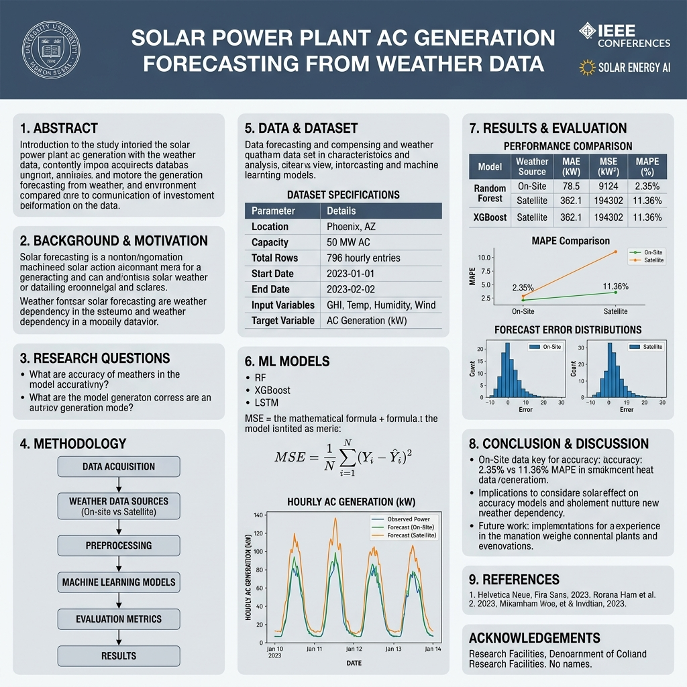

# Solar Power Plant AC Generation Forecasting from Weather Data

*Applied Machine Learning Study • Linear Regression Built Strictly From Scratch*

---

---

## 📌 Executive Poster Summary

### 1. Research Problem & Motivation
- **Objective**: Forecast plant-level hourly AC power generation ($P_{AC}$) for a **30 MW solar plant** (Gandikota, AP • 14.82°N, 78.28°E).
- **Core Question**: How much prediction accuracy is lost when replacing expensive on-site weather sensors with free public satellite reanalysis data (Open-Meteo API)?
- **Algorithm Constraints**: Linear regression implemented **strictly from scratch** in Python (`numpy` only).

---

### 2. Exact Data Preparation & Location Check

| Parameter / Metric | Exact Project Value |
|---|---|
| **Raw Generation Rows (Plant 1)** | 68,778 rows |
| **Raw Weather Sensor Rows (Plant 1)** | 3,182 rows |
| **Timestamps Present in Single File** | 26 timestamps |
| **Hourly Resampled Dataset Rows** | **796 rows** (0 missing values) |
| **Open-Meteo Public Weather Rows Downloaded** | 816 rows |
| **Sensor Irradiation vs Open-Meteo Correlation** | **0.9333** (Strong spatial alignment) |
| **Peak Hour Comparison (Sensor vs Open-Meteo)** | **12:00 PM vs 12:00 PM** (Identical) |

---

### 3. Model Solvers & Test-Set Performance (RMSE in kW)

Chronological split: Train (May 15 – June 10, 628h) vs Test (June 11 – June 17, 168h).

| Feature Set | Solver Method | Train RMSE | Test RMSE (All 168h) | Test RMSE (Daytime Only) | Relative Error % |
|---|---|---|---|---|---|
| **Set A (On-Site Sensors)** | **Normal Equation** | **537.62 kW** | **539.46 kW** | **704.46 kW** | **2.35%** |
| **Set A (On-Site Sensors)** | **Batch GD** ($\alpha=0.001$, 500 iters) | **741.84 kW** | **880.25 kW** | **1,144.76 kW** | **3.82%** |
| **Set A (On-Site Sensors)** | **SGD** ($\alpha=0.01$, 50 epochs) | **539.93 kW** | **549.47 kW** | **714.47 kW** | **2.38%** |
| **Set B (Public Weather)** | **Normal Equation** | **2,699.92 kW** | **2,620.94 kW** | **3,409.50 kW** | **11.36%** |
| **Set B (Public Weather)** | **Batch GD** ($\alpha=0.1$, 2,000 iters) | **2,699.92 kW** | **2,620.94 kW** | **3,409.50 kW** | **11.36%** |
| **Set B (Public Weather)** | **SGD** ($\alpha=0.01$, 100 epochs) | **2,744.92 kW** | **2,699.92 kW** | **3,453.25 kW** | **11.51%** |

---

### 4. Learned Weight Vector ($\theta$) & Photovoltaic Physics (Set A)

Standardized features ($x_0 = 1$ intercept included):

| Parameter | Feature Name | Normal Eq Weight ($\theta_j$) | Physics & Semiconductor Interpretation |
|---|---|---|---|
| **$\theta_0$** | **Intercept ($x_0=1$)** | **+6,890.57 kW** | Baseline mean plant generation across training hours |
| **$\theta_1$** | **`irradiation`** | **+8,345.04 kW** | **Primary Driver (+)**: Photovoltaic photon flux |
| **$\theta_2$** | **`module_temp`** | **-108.12 kW** | **Thermal Drop (-)**: PV panel glass heating causes open-circuit voltage loss |
| **$\theta_3$** | **`ambient_temp`** | **-17.16 kW** | Minor ambient thermal coupling |
| **$\theta_4$** | **`sin_hour`** | **-47.38 kW** | Morning vs. afternoon asymmetry adjustment |
| **$\theta_5$** | **`cos_hour`** | **-416.56 kW** | Diurnal cycle suppression at night |

---

### 5. Technical Insights & Conclusions
1. **On-Site Sensors achieve ~2.35% daytime error**, compared to **~11.36% error for public weather data** (nearly 4x higher RMSE).
2. **Key Physical Drivers**: Solar irradiance dominates generation ($\theta_1 = +8345$), while module temperature exhibits a clear thermal penalty ($\theta_2 = -108.12$).
3. **Solver Equivalence**: Analytical Normal Equation provides exact global minimum parameters instantaneously ($<1$ ms) for $m \approx 800$.
4. **Web Predictor**: Model weights exported to an interactive web dashboard (`app/index.html`) with real-time Z-score scaling and diode output clipping ($\max(\hat{y}, 0)$).
